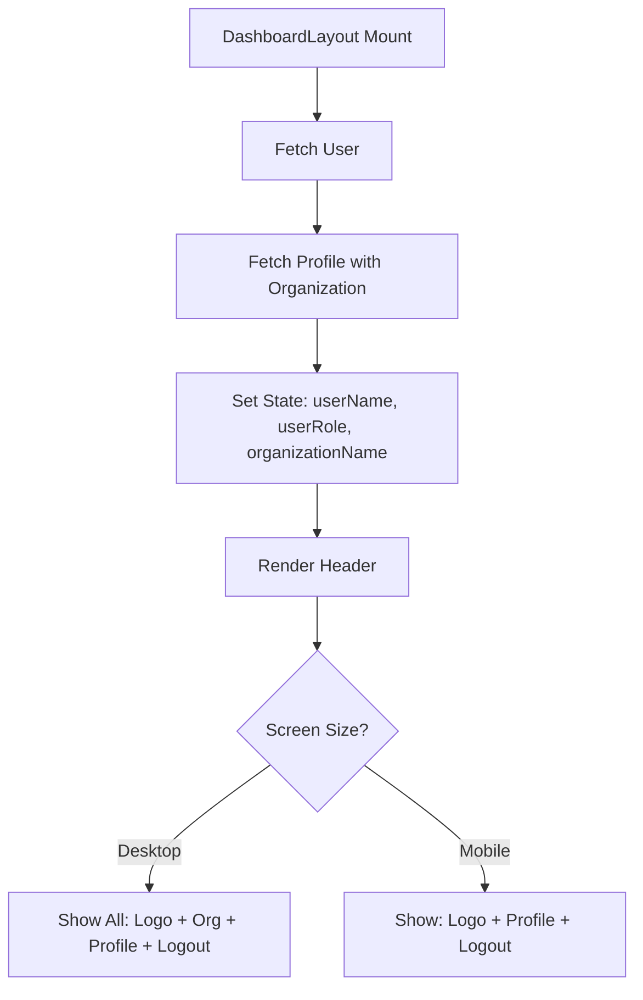

# Design Document

## Overview

Bu doküman, DashboardLayout component'inin header bölümüne organizasyon ismi ve kullanıcı profil bilgilerinin eklenmesi için tasarım detaylarını içerir. Mevcut header yapısı korunarak, yeni bilgiler responsive ve performanslı bir şekilde entegre edilecektir.

## Architecture

### Component Hierarchy

```
DashboardLayout
├── Header
│   ├── Logo (Vector)
│   ├── Organization Name (NEW)
│   └── User Section
│       ├── Profile Name (ENHANCED)
│       └── Logout Button
├── Sidebar (Desktop)
└── Bottom Navigation (Mobile)
```

### Data Flow



## Components and Interfaces

### 1. DashboardLayout Component (Modified)

**Yeni State:**
```typescript
const [organizationName, setOrganizationName] = useState<string>('');
```

**Güncellenmiş fetchUserProfile Fonksiyonu:**
```typescript
const fetchUserProfile = async () => {
  try {
    const { data: { user } } = await supabase.auth.getUser();
    if (!user) {
      router.push('/login');
      return;
    }

    // JOIN query ile profile ve organization bilgisini tek sorguda çek
    const { data: profile } = await supabase
      .from('profiles')
      .select(`
        role,
        name,
        surname,
        organizations (
          name
        )
      `)
      .eq('id', user.id)
      .single();

    if (profile) {
      setUserRole(profile.role);
      setUserName(`${profile.name} ${profile.surname}`);
      // organizations bir array döner (Supabase JOIN yapısı)
      if (profile.organizations && Array.isArray(profile.organizations) && profile.organizations.length > 0) {
        setOrganizationName(profile.organizations[0].name);
      } else if (profile.organizations && !Array.isArray(profile.organizations)) {
        setOrganizationName((profile.organizations as any).name);
      }
    }
  } catch (error) {
    console.error('Error fetching profile:', error);
  } finally {
    setIsLoading(false);
  }
};
```

### 2. Header Section (Modified)

**Desktop Layout (≥768px):**
```tsx
<header className="bg-white shadow-sm fixed top-0 left-0 right-0 z-40">
  <div className="max-w-7xl mx-auto px-4 sm:px-6 lg:px-8">
    <div className="flex justify-between items-center h-16">
      {/* Left: Logo */}
      <div className="flex items-center">
        <Link href="/personnel" className="text-2xl font-bold text-blue-600">
          Vector
        </Link>
      </div>
      
      {/* Center: Organization Name (Desktop only) */}
      <div className="hidden md:block">
        {organizationName && (
          <div className="text-sm font-medium text-gray-700 px-4 py-2 bg-gray-50 rounded-lg">
            {organizationName}
          </div>
        )}
      </div>
      
      {/* Right: User Section */}
      <div className="flex items-center gap-4">
        <span className="text-sm text-gray-700 hidden sm:block">
          {userName}
        </span>
        <button
          onClick={handleLogout}
          className="text-sm text-gray-600 hover:text-gray-900 min-h-[44px] px-4"
        >
          Çıkış
        </button>
      </div>
    </div>
  </div>
</header>
```

**Mobile Layout (<768px):**
- Organization name gizlenir (alan tasarrufu için)
- Logo, profil ismi ve çıkış butonu görünür kalır
- Profil ismi 640px altında gizlenebilir (isteğe bağlı)

## Data Models

### Extended Profile Type (Query Result)

```typescript
interface ProfileWithOrganization extends Profile {
  organizations: {
    name: string;
  } | Array<{ name: string }>;
}
```

Bu tip sadece query sonucu için kullanılır, global type tanımına eklenmez.

## Error Handling

### 1. Organization Bilgisi Yüklenemezse

```typescript
// Hata durumunda organizationName boş string kalır
// Header render edilir ama organization ismi gösterilmez
// Diğer fonksiyonlar (logout, navigation) çalışmaya devam eder
```

### 2. Profile Bilgisi Yüklenemezse

```typescript
// Mevcut error handling korunur
// Console'a error loglanır
// Loading state false yapılır
// Header minimal şekilde render edilir
```

### 3. Network Hatası

```typescript
// try-catch bloğu mevcut hatayı yakalar
// finally bloğu loading state'i her durumda false yapar
// Kullanıcı logout yapıp tekrar giriş yapabilir
```

## Testing Strategy

### Unit Tests

1. **fetchUserProfile fonksiyonu:**
   - Profile ve organization bilgisini doğru şekilde çekiyor mu?
   - State'leri doğru şekilde set ediyor mu?
   - Hata durumunda graceful fail ediyor mu?

2. **Header render:**
   - Organization name doğru gösteriliyor mu?
   - Responsive breakpoint'lerde doğru davranıyor mu?
   - Loading state'de doğru render ediliyor mu?

### Integration Tests

1. **Auth flow ile entegrasyon:**
   - Login sonrası organization bilgisi yükleniyor mu?
   - Logout sonrası state temizleniyor mu?

2. **Database query:**
   - JOIN query doğru çalışıyor mu?
   - RLS policies izin veriyor mu?

### Manual Testing Checklist

- [ ] Desktop'ta tüm bilgiler görünüyor
- [ ] Tablet'te organization name görünüyor
- [ ] Mobile'da organization name gizli
- [ ] Profil ismi doğru gösteriliyor
- [ ] Çıkış butonu çalışıyor
- [ ] Loading state düzgün
- [ ] Hata durumunda uygulama çökmüyor

## Performance Considerations

### 1. Query Optimization

- **Tek sorgu:** Profile ve organization bilgisi tek JOIN query ile çekilir
- **Gereksiz field'lar çekilmez:** Sadece gerekli alanlar select edilir
- **Cache:** Supabase client otomatik cache yapar

### 2. Re-render Optimization

- **State güncellemeleri:** Sadece gerekli state'ler güncellenir
- **Memoization:** Gerekirse useMemo ile organization name memoize edilebilir
- **useEffect dependency:** fetchUserProfile sadece mount'ta çalışır

### 3. Bundle Size

- **Yeni dependency yok:** Mevcut kütüphaneler kullanılır
- **Kod artışı minimal:** ~30-40 satır ekleme

## Responsive Design

### Breakpoints

- **Mobile (< 640px):** Logo + Çıkış
- **Small (640px - 768px):** Logo + Profil İsmi + Çıkış
- **Medium (768px - 1024px):** Logo + Organization + Profil İsmi + Çıkış
- **Desktop (≥ 1024px):** Tüm elementler tam boyut

### Touch Targets

- Tüm interaktif elementler minimum 44x44px (Apple HIG)
- Çıkış butonu: min-h-[44px] px-4
- Organization badge: Tıklanabilir değil, sadece görsel

## Styling

### Organization Badge

```css
/* Desktop */
.org-badge {
  @apply text-sm font-medium text-gray-700 px-4 py-2 bg-gray-50 rounded-lg;
}

/* Hover effect (opsiyonel, gelecekte tıklanabilir olabilir) */
.org-badge:hover {
  @apply bg-gray-100;
}
```

### Profile Name

```css
/* Mevcut stil korunur */
.profile-name {
  @apply text-sm text-gray-700 hidden sm:block;
}
```

## Future Enhancements

1. **Organization Switcher:** Kullanıcı birden fazla organizasyona üyeyse dropdown ile değiştirebilir
2. **Profile Dropdown:** Profil ismine tıklayınca ayarlar menüsü açılabilir
3. **Notification Badge:** Organization isminin yanında bildirim sayısı gösterilebilir
4. **Theme Support:** Dark mode desteği eklenebilir

## Migration Notes

- **Breaking Changes:** Yok
- **Database Changes:** Yok (mevcut schema kullanılır)
- **API Changes:** Yok
- **Backward Compatibility:** Tam uyumlu

## Security Considerations

1. **RLS Policies:** Mevcut policies yeterli (kullanıcı sadece kendi organization'ını görebilir)
2. **XSS Protection:** Organization name React tarafından otomatik escape edilir
3. **Data Exposure:** Sadece organization name expose edilir (hassas bilgi yok)

## Accessibility

1. **Semantic HTML:** Header tag kullanılır
2. **ARIA Labels:** Gerekirse organization badge'e aria-label eklenebilir
3. **Keyboard Navigation:** Tüm interaktif elementler keyboard ile erişilebilir
4. **Screen Reader:** Organization name screen reader tarafından okunabilir

## Implementation Notes

1. **Tek dosya değişiklik:** Sadece `components/layout/DashboardLayout.tsx` güncellenecek
2. **Satır sayısı:** Mevcut ~180 satır → ~220 satır (limit: 600)
3. **Test coverage:** Mevcut testler güncellenmeli
4. **Documentation:** README'ye yeni özellik eklenebilir
