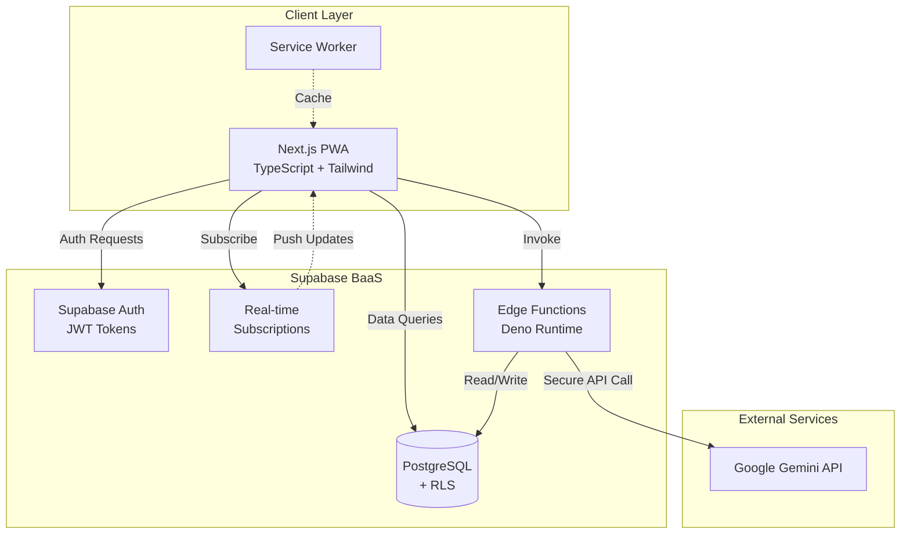

# Design Document - Vector PWA

## Overview

Vector, serverless mimari üzerine kurulu, mobil-öncelikli bir Progresif Web Uygulamasıdır. Sistem, organizasyon bazlı çok-kullanıcılı yapıda, rol tabanlı yetki yönetimi ile personel performans takibi ve AI destekli geri bildirim oluşturma sağlar.

### Temel Prensipler

- **Serverless-First**: Geleneksel backend sunucusu yok, tüm backend mantığı Supabase Edge Functions'da
- **Mobile-First**: Tüm UI mobil cihazlar için optimize edilmiş, responsive tasarım
- **Real-time**: Supabase Real-time ile anlık veri senkronizasyonu
- **Security-First**: RLS politikaları, JWT token yönetimi, API key'lerin güvenli saklanması
- **Modular**: Her dosya max 600 satır, bileşen bazlı mimari

## Architecture

### High-Level Architecture



### Technology Stack

**Frontend:**
- Next.js 14+ (App Router)
- TypeScript
- Tailwind CSS
- Supabase-js client
- Web Speech API (sesli not için)

**Backend (Supabase):**
- PostgreSQL (veritabanı)
- Supabase Auth (kimlik doğrulama)
- Edge Functions (Deno runtime)
- Real-time (WebSocket subscriptions)
- Row Level Security (RLS)

**AI:**
- Google Gemini API (Edge Functions üzerinden)

**Deployment:**
- Railway (frontend - geliştirme aşamasında localhost)
- GitHub (version control)
- Supabase Cloud (backend)

## Components and Interfaces

### Frontend Component Structure

```
src/
├── app/                          # Next.js App Router
│   ├── (auth)/                   # Auth layout group
│   │   ├── login/
│   │   └── register/
│   ├── (dashboard)/              # Protected routes
│   │   ├── layout.tsx            # Dashboard layout with nav
│   │   ├── personnel/
│   │   │   ├── page.tsx          # Personnel list
│   │   │   └── [id]/
│   │   │       └── page.tsx      # Personnel detail
│   │   ├── my-tasks/
│   │   │   └── page.tsx          # Personnel's task view
│   │   ├── settings/
│   │   │   ├── organization/     # Org settings (Owner only)
│   │   │   └── permissions/      # Permission management (Owner only)
│   │   └── page.tsx              # Dashboard home
│   ├── layout.tsx                # Root layout
│   └── manifest.ts               # PWA manifest
├── components/
│   ├── auth/
│   │   ├── LoginForm.tsx
│   │   └── RegisterForm.tsx
│   ├── personnel/
│   │   ├── PersonnelCard.tsx
│   │   ├── PersonnelList.tsx
│   │   └── PersonnelForm.tsx
│   ├── notes/
│   │   ├── NoteForm.tsx
│   │   ├── NoteList.tsx
│   │   ├── NoteItem.tsx
│   │   └── VoiceRecorder.tsx
│   ├── tasks/
│   │   ├── TaskForm.tsx
│   │   ├── TaskList.tsx
│   │   ├── TaskItem.tsx
│   │   └── TaskCloseModal.tsx
│   ├── analysis/
│   │   ├── AnalysisButton.tsx
│   │   ├── AnalysisDisplay.tsx
│   │   └── AnalysisHistory.tsx
│   ├── permissions/
│   │   ├── PermissionMatrix.tsx
│   │   └── PermissionToggle.tsx
│   └── ui/                       # Reusable UI components
│       ├── Button.tsx
│       ├── Input.tsx
│       ├── Modal.tsx
│       ├── Card.tsx
│       └── StarRating.tsx
├── lib/
│   ├── supabase/
│   │   ├── client.ts             # Supabase client setup
│   │   ├── server.ts             # Server-side client
│   │   └── middleware.ts         # Auth middleware
│   ├── hooks/
│   │   ├── useAuth.ts
│   │   ├── usePermissions.ts
│   │   ├── useRealtime.ts
│   │   └── useVoiceRecognition.ts
│   ├── utils/
│   │   ├── permissions.ts        # Permission check utilities
│   │   ├── date.ts               # Date formatting
│   │   └── validation.ts         # Form validation
│   └── types/
│       └── database.types.ts     # Generated from Supabase
├── public/
│   ├── icons/                    # PWA icons
│   └── sw.js                     # Service Worker
└── middleware.ts                 # Next.js middleware for auth
```

### Key Components

#### 1. Authentication Components

**LoginForm.tsx**
- Username/password input
- Supabase Auth integration
- Error handling
- Redirect after login

**RegisterForm.tsx**
- Name, surname, username, password fields
- Optional invite code field
- Organization creation logic
- Username uniqueness validation

#### 2. Personnel Management

**PersonnelCard.tsx**
- Display personnel info
- Quick actions (view, edit, delete)
- Permission-based action visibility

**PersonnelList.tsx**
- Grid/list view of personnel
- Search and filter
- Add new personnel button (permission-based)

#### 3. Notes Management

**NoteForm.tsx**
- Text input for notes
- Voice recorder integration
- Submit and cancel actions
- Author tracking

**VoiceRecorder.tsx**
- Web Speech API integration
- Start/stop recording
- Real-time transcription display
- Error handling for unsupported browsers

**NoteList.tsx**
- Chronological display
- Mixed notes and closed tasks
- Edit/delete actions (permission-based)
- Real-time updates

#### 4. Tasks Management

**TaskForm.tsx**
- Task description input
- Optional deadline picker
- Default to current date
- Submit validation

**TaskList.tsx**
- Open tasks display
- Deadline sorting
- Overdue highlighting
- Close task action (permission-based)

**TaskCloseModal.tsx**
- Star rating selector (1-5)
- Completion confirmation
- Timestamp capture

#### 5. AI Analysis

**AnalysisButton.tsx**
- Trigger analysis
- Loading state
- Permission check
- Minimum data validation

**AnalysisDisplay.tsx**
- Strengths section
- Development areas section
- Timestamp display
- Refresh button

#### 6. Permission Management

**PermissionMatrix.tsx**
- Role x Resource x Action grid
- Toggle switches for permissions
- Owner-only access
- Real-time updates

### Backend Components (Supabase Edge Functions)

```
supabase/
├── functions/
│   ├── analyze-personnel/
│   │   └── index.ts              # AI analysis function
│   ├── create-organization/
│   │   └── index.ts              # Org creation with invite code
│   └── _shared/
│       ├── supabase.ts           # Supabase client
│       └── gemini.ts             # Gemini API wrapper
└── migrations/
    ├── 001_initial_schema.sql
    ├── 002_rls_policies.sql
    └── 003_permissions_table.sql
```

**analyze-personnel Edge Function**
```typescript
// Pseudo-code
async function analyzePersonnel(personnelId: string) {
  // 1. Verify user has permission
  // 2. Fetch all notes for personnel
  // 3. Fetch all closed tasks with ratings
  // 4. Format data for Gemini prompt
  // 5. Call Gemini API with structured prompt
  // 6. Parse response
  // 7. Save to ai_analyses table
  // 8. Return analysis to client
}
```

## Data Models

### Database Schema

```sql
-- Organizations
CREATE TABLE organizations (
  id UUID PRIMARY KEY DEFAULT uuid_generate_v4(),
  name TEXT NOT NULL,
  invite_code TEXT UNIQUE NOT NULL,
  created_at TIMESTAMPTZ DEFAULT NOW(),
  updated_at TIMESTAMPTZ DEFAULT NOW()
);

-- Profiles (extends auth.users)
CREATE TABLE profiles (
  id UUID PRIMARY KEY REFERENCES auth.users(id) ON DELETE CASCADE,
  organization_id UUID REFERENCES organizations(id) ON DELETE CASCADE,
  role TEXT NOT NULL CHECK (role IN ('owner', 'manager', 'personnel')),
  name TEXT NOT NULL,
  surname TEXT NOT NULL,
  username TEXT UNIQUE NOT NULL,
  created_at TIMESTAMPTZ DEFAULT NOW(),
  updated_at TIMESTAMPTZ DEFAULT NOW()
);

-- Permissions
CREATE TABLE permissions (
  id UUID PRIMARY KEY DEFAULT uuid_generate_v4(),
  organization_id UUID REFERENCES organizations(id) ON DELETE CASCADE,
  role TEXT NOT NULL CHECK (role IN ('manager', 'personnel')),
  resource_type TEXT NOT NULL CHECK (resource_type IN ('notes', 'tasks', 'personnel')),
  can_view BOOLEAN DEFAULT FALSE,
  can_create BOOLEAN DEFAULT FALSE,
  can_edit BOOLEAN DEFAULT FALSE,
  can_delete BOOLEAN DEFAULT FALSE,
  created_at TIMESTAMPTZ DEFAULT NOW(),
  updated_at TIMESTAMPTZ DEFAULT NOW(),
  UNIQUE(organization_id, role, resource_type)
);

-- Personnel
CREATE TABLE personnel (
  id UUID PRIMARY KEY DEFAULT uuid_generate_v4(),
  organization_id UUID REFERENCES organizations(id) ON DELETE CASCADE,
  name TEXT NOT NULL,
  metadata JSONB DEFAULT '{}',
  created_at TIMESTAMPTZ DEFAULT NOW(),
  updated_at TIMESTAMPTZ DEFAULT NOW()
);

-- Notes
CREATE TABLE notes (
  id UUID PRIMARY KEY DEFAULT uuid_generate_v4(),
  personnel_id UUID REFERENCES personnel(id) ON DELETE CASCADE,
  author_id UUID REFERENCES profiles(id) ON DELETE CASCADE,
  content TEXT NOT NULL,
  is_voice_note BOOLEAN DEFAULT FALSE,
  created_at TIMESTAMPTZ DEFAULT NOW(),
  updated_at TIMESTAMPTZ DEFAULT NOW()
);

-- Tasks
CREATE TABLE tasks (
  id UUID PRIMARY KEY DEFAULT uuid_generate_v4(),
  personnel_id UUID REFERENCES personnel(id) ON DELETE CASCADE,
  description TEXT NOT NULL,
  deadline DATE NOT NULL,
  status TEXT NOT NULL CHECK (status IN ('open', 'closed')) DEFAULT 'open',
  star_rating INTEGER CHECK (star_rating >= 1 AND star_rating <= 5),
  completed_at TIMESTAMPTZ,
  created_at TIMESTAMPTZ DEFAULT NOW(),
  updated_at TIMESTAMPTZ DEFAULT NOW()
);

-- AI Analyses
CREATE TABLE ai_analyses (
  id UUID PRIMARY KEY DEFAULT uuid_generate_v4(),
  personnel_id UUID REFERENCES personnel(id) ON DELETE CASCADE,
  strengths JSONB NOT NULL,
  development_areas JSONB NOT NULL,
  raw_response TEXT,
  created_at TIMESTAMPTZ DEFAULT NOW()
);

-- Indexes for performance
CREATE INDEX idx_profiles_org ON profiles(organization_id);
CREATE INDEX idx_profiles_username ON profiles(username);
CREATE INDEX idx_personnel_org ON personnel(organization_id);
CREATE INDEX idx_notes_personnel ON notes(personnel_id);
CREATE INDEX idx_notes_author ON notes(author_id);
CREATE INDEX idx_tasks_personnel ON tasks(personnel_id);
CREATE INDEX idx_tasks_status ON tasks(status);
CREATE INDEX idx_analyses_personnel ON ai_analyses(personnel_id);
```

### TypeScript Types

```typescript
// Database types (generated from Supabase)
export type Role = 'owner' | 'manager' | 'personnel';
export type ResourceType = 'notes' | 'tasks' | 'personnel';
export type TaskStatus = 'open' | 'closed';

export interface Organization {
  id: string;
  name: string;
  invite_code: string;
  created_at: string;
  updated_at: string;
}

export interface Profile {
  id: string;
  organization_id: string;
  role: Role;
  name: string;
  surname: string;
  username: string;
  created_at: string;
  updated_at: string;
}

export interface Permission {
  id: string;
  organization_id: string;
  role: Role;
  resource_type: ResourceType;
  can_view: boolean;
  can_create: boolean;
  can_edit: boolean;
  can_delete: boolean;
}

export interface Personnel {
  id: string;
  organization_id: string;
  name: string;
  metadata: Record<string, any>;
  created_at: string;
  updated_at: string;
}

export interface Note {
  id: string;
  personnel_id: string;
  author_id: string;
  content: string;
  is_voice_note: boolean;
  created_at: string;
  updated_at: string;
}

export interface Task {
  id: string;
  personnel_id: string;
  description: string;
  deadline: string;
  status: TaskStatus;
  star_rating: number | null;
  completed_at: string | null;
  created_at: string;
  updated_at: string;
}

export interface AIAnalysis {
  id: string;
  personnel_id: string;
  strengths: string[];
  development_areas: string[];
  raw_response: string;
  created_at: string;
}
```

## Error Handling

### Frontend Error Handling

**Authentication Errors**
- Invalid credentials → User-friendly message
- Network errors → Retry mechanism
- Session expired → Redirect to login

**Permission Errors**
- Unauthorized action → Toast notification
- Missing permissions → Hide UI elements proactively

**Data Errors**
- Failed to load → Retry button
- Failed to save → Show error, keep form data
- Validation errors → Inline field errors

**Voice Recognition Errors**
- Browser not supported → Show text input only
- Microphone access denied → Permission request with explanation
- Recognition failed → Allow retry or switch to text

### Backend Error Handling

**Edge Function Errors**
```typescript
try {
  // Function logic
} catch (error) {
  console.error('Function error:', error);
  return new Response(
    JSON.stringify({ error: error.message }),
    { status: 500, headers: { 'Content-Type': 'application/json' } }
  );
}
```

**Database Errors**
- Constraint violations → Meaningful error messages
- RLS policy violations → 403 Forbidden
- Connection errors → Retry with exponential backoff

**AI API Errors**
- Rate limiting → Queue requests
- API errors → Log and notify user
- Timeout → Configurable timeout with fallback

## Security

### Authentication & Authorization

**Supabase Auth Flow**
1. User submits credentials
2. Supabase Auth validates and issues JWT
3. JWT stored in httpOnly cookie (server-side) or localStorage (client-side)
4. Every request includes JWT in Authorization header
5. Supabase validates JWT and extracts user_id

**Row Level Security (RLS) Policies**

```sql
-- Profiles: Users can only see profiles in their organization
CREATE POLICY "Users can view org profiles"
  ON profiles FOR SELECT
  USING (organization_id = (
    SELECT organization_id FROM profiles WHERE id = auth.uid()
  ));

-- Notes: Complex visibility based on permissions
CREATE POLICY "Notes visibility"
  ON notes FOR SELECT
  USING (
    -- Owner sees all
    EXISTS (
      SELECT 1 FROM profiles 
      WHERE id = auth.uid() 
      AND role = 'owner'
      AND organization_id = (
        SELECT organization_id FROM personnel WHERE id = notes.personnel_id
      )
    )
    OR
    -- Others see only their own notes
    author_id = auth.uid()
  );

-- Tasks: Everyone in org can view
CREATE POLICY "Tasks visible to org"
  ON tasks FOR SELECT
  USING (
    EXISTS (
      SELECT 1 FROM personnel p
      JOIN profiles pr ON pr.organization_id = p.organization_id
      WHERE p.id = tasks.personnel_id
      AND pr.id = auth.uid()
    )
  );

-- Permission-based INSERT/UPDATE/DELETE policies
-- (Similar pattern for each resource type)
```

### API Security

**Edge Functions**
- Validate JWT on every request
- Check user permissions before operations
- Sanitize inputs
- Rate limiting
- CORS configuration

**Gemini API Key**
- Stored in Supabase Secrets (never in frontend)
- Accessed only by Edge Functions
- Rotated periodically

### Data Privacy

- Passwords hashed by Supabase Auth (bcrypt)
- No PII in logs
- HTTPS only
- Secure cookie flags (httpOnly, secure, sameSite)

## Testing Strategy

### Unit Tests

**Frontend Components**
- Component rendering
- User interactions
- Permission-based visibility
- Form validation
- Error states

**Utility Functions**
- Permission checks
- Date formatting
- Validation logic

**Backend Functions**
- Data transformation
- Permission validation
- API response parsing

### Integration Tests

**Authentication Flow**
- Registration with/without invite code
- Login/logout
- Session persistence
- Protected route access

**CRUD Operations**
- Create personnel
- Add notes (text and voice)
- Create and close tasks
- Permission enforcement

**Real-time Updates**
- Note added → UI updates
- Task closed → Removed from My Tasks
- Permission changed → UI reflects immediately

### End-to-End Tests

**Critical User Journeys**
1. Owner creates org → Invites manager → Manager adds personnel → Creates note
2. Manager creates task → Personnel sees in My Tasks → Manager closes with rating
3. Manager triggers AI analysis → Views results
4. Owner changes permissions → Manager's UI updates

**PWA Tests**
- Install prompt
- Offline functionality
- Service Worker caching
- Manifest validation

### Performance Tests

- Page load times (< 2s on 3G)
- Real-time latency (< 500ms)
- AI analysis response time (< 10s)
- Database query performance

## PWA Implementation

### Manifest Configuration

```json
{
  "name": "Vector - Personnel Feedback",
  "short_name": "Vector",
  "description": "AI-powered personnel feedback and task management",
  "start_url": "/",
  "display": "standalone",
  "background_color": "#ffffff",
  "theme_color": "#3b82f6",
  "orientation": "portrait-primary",
  "icons": [
    {
      "src": "/icons/icon-72x72.png",
      "sizes": "72x72",
      "type": "image/png"
    },
    {
      "src": "/icons/icon-192x192.png",
      "sizes": "192x192",
      "type": "image/png",
      "purpose": "any maskable"
    },
    {
      "src": "/icons/icon-512x512.png",
      "sizes": "512x512",
      "type": "image/png"
    }
  ]
}
```

### Service Worker Strategy

**Caching Strategy**
- **App Shell**: Cache-first (HTML, CSS, JS)
- **API Responses**: Network-first with cache fallback
- **Images**: Cache-first with stale-while-revalidate
- **Dynamic Content**: Network-only (notes, tasks)

**Offline Functionality**
- Show cached personnel list
- Display "Offline" indicator
- Queue writes for when online
- Sync when connection restored

### Installation Prompt

```typescript
// Detect install prompt
window.addEventListener('beforeinstallprompt', (e) => {
  e.preventDefault();
  // Show custom install button
  showInstallPrompt(e);
});
```

## Real-time Implementation

### Supabase Real-time Subscriptions

**Personnel Detail Page**
```typescript
useEffect(() => {
  const notesChannel = supabase
    .channel(`personnel-${personnelId}-notes`)
    .on('postgres_changes', 
      { event: '*', schema: 'public', table: 'notes', filter: `personnel_id=eq.${personnelId}` },
      (payload) => {
        // Update notes list
        handleNoteChange(payload);
      }
    )
    .subscribe();

  const tasksChannel = supabase
    .channel(`personnel-${personnelId}-tasks`)
    .on('postgres_changes',
      { event: '*', schema: 'public', table: 'tasks', filter: `personnel_id=eq.${personnelId}` },
      (payload) => {
        // Update tasks list
        handleTaskChange(payload);
      }
    )
    .subscribe();

  return () => {
    supabase.removeChannel(notesChannel);
    supabase.removeChannel(tasksChannel);
  };
}, [personnelId]);
```

**My Tasks Page (Personnel)**
```typescript
useEffect(() => {
  const channel = supabase
    .channel('my-tasks')
    .on('postgres_changes',
      { event: '*', schema: 'public', table: 'tasks' },
      (payload) => {
        // Filter for current user's tasks
        // Update task list
        handleMyTaskChange(payload);
      }
    )
    .subscribe();

  return () => {
    supabase.removeChannel(channel);
  };
}, []);
```

## AI Integration

### Gemini API Integration

**Prompt Structure**
```typescript
const prompt = `
Analyze the following personnel performance data and provide structured feedback.

Personnel: ${personnelName}

Notes (${notes.length} total):
${notes.map(n => `- [${n.created_at}] ${n.content}`).join('\n')}

Completed Tasks (${tasks.length} total):
${tasks.map(t => `- [${t.completed_at}] ${t.description} - Rating: ${t.star_rating}/5`).join('\n')}

Please provide:
1. Strengths (güçlü yönler): List 3-5 key strengths based on the data
2. Development Areas (gelişim alanları): List 3-5 areas for improvement

Format your response as JSON:
{
  "strengths": ["strength 1", "strength 2", ...],
  "development_areas": ["area 1", "area 2", ...]
}
`;
```

**Edge Function Implementation**
```typescript
import { GoogleGenerativeAI } from '@google/generative-ai';

const genAI = new GoogleGenerativeAI(Deno.env.get('GEMINI_API_KEY'));

export async function analyzePersonnel(personnelId: string, userId: string) {
  // 1. Verify permissions
  const { data: profile } = await supabase
    .from('profiles')
    .select('role, organization_id')
    .eq('id', userId)
    .single();

  if (!['owner', 'manager'].includes(profile.role)) {
    throw new Error('Unauthorized');
  }

  // 2. Fetch data
  const { data: notes } = await supabase
    .from('notes')
    .select('*')
    .eq('personnel_id', personnelId);

  const { data: tasks } = await supabase
    .from('tasks')
    .select('*')
    .eq('personnel_id', personnelId)
    .eq('status', 'closed');

  // 3. Generate prompt
  const prompt = buildPrompt(notes, tasks);

  // 4. Call Gemini
  const model = genAI.getGenerativeModel({ model: 'gemini-pro' });
  const result = await model.generateContent(prompt);
  const response = await result.response;
  const text = response.text();

  // 5. Parse response
  const analysis = JSON.parse(text);

  // 6. Save to database
  const { data: savedAnalysis } = await supabase
    .from('ai_analyses')
    .insert({
      personnel_id: personnelId,
      strengths: analysis.strengths,
      development_areas: analysis.development_areas,
      raw_response: text
    })
    .select()
    .single();

  return savedAnalysis;
}
```

## Mobile-First Design

### Responsive Breakpoints (Tailwind)

```typescript
// tailwind.config.js
module.exports = {
  theme: {
    screens: {
      'sm': '640px',   // Mobile landscape, small tablets
      'md': '768px',   // Tablets
      'lg': '1024px',  // Desktops
      'xl': '1280px',  // Large desktops
    }
  }
}
```

### Touch Optimization

- Minimum touch target: 44x44px
- Adequate spacing between interactive elements
- Swipe gestures for common actions
- Pull-to-refresh on lists
- Bottom navigation for mobile

### Performance Optimization

- Image optimization (Next.js Image component)
- Code splitting (Next.js automatic)
- Lazy loading for non-critical components
- Prefetching for navigation
- Minimize bundle size (< 200KB initial load)

## Deployment Architecture

### Development Environment

- **Frontend**: localhost:3000 (Next.js dev server)
- **Backend**: Supabase local development
- **Database**: Local PostgreSQL via Supabase CLI

### Production Environment

**Frontend (Railway)**
- Next.js production build
- Environment variables for Supabase URL and anon key
- Automatic deployments from GitHub main branch
- Custom domain configuration

**Backend (Supabase Cloud)**
- Managed PostgreSQL database
- Edge Functions deployed via Supabase CLI
- Environment secrets for Gemini API key
- Automatic backups

**CI/CD Pipeline (GitHub Actions)**
```yaml
# .github/workflows/deploy.yml
name: Deploy
on:
  push:
    branches: [main]
jobs:
  deploy:
    runs-on: ubuntu-latest
    steps:
      - uses: actions/checkout@v2
      - name: Deploy to Railway
        run: railway up
      - name: Deploy Supabase Functions
        run: supabase functions deploy
```

## File Size Management

### Strategies

1. **Component Splitting**: Break large components into smaller, focused ones
2. **Utility Modules**: Extract reusable logic into separate files
3. **Type Definitions**: Keep types in separate files
4. **Custom Hooks**: Extract stateful logic into hooks
5. **Constants**: Separate configuration and constants

### Monitoring

- Pre-commit hook to check file sizes
- CI/CD check to fail if any file > 600 lines
- Regular refactoring sprints

### Example Refactoring

**Before** (PersonnelDetailPage.tsx - 800 lines):
```
- Component logic
- Note management
- Task management
- Analysis display
- Permission checks
```

**After** (split into multiple files):
- PersonnelDetailPage.tsx (150 lines) - Layout and orchestration
- PersonnelInfo.tsx (100 lines) - Personnel information display
- NotesSection.tsx (120 lines) - Notes list and form
- TasksSection.tsx (120 lines) - Tasks list and form
- AnalysisSection.tsx (100 lines) - AI analysis display
- usePersonnelData.ts (80 lines) - Data fetching hook
- usePersonnelPermissions.ts (60 lines) - Permission logic hook

## Design Decisions and Rationales

### Why Supabase over Custom Backend?

- **Speed**: Faster development, no need to build auth, database, real-time from scratch
- **Security**: Built-in RLS, JWT handling, secure by default
- **Scalability**: Managed infrastructure, automatic scaling
- **Cost**: Pay-as-you-go, no server maintenance

### Why Edge Functions over Client-Side AI Calls?

- **Security**: API keys never exposed to client
- **Control**: Rate limiting, logging, monitoring
- **Flexibility**: Can add caching, preprocessing, post-processing

### Why Next.js App Router?

- **Performance**: React Server Components, automatic code splitting
- **SEO**: Server-side rendering (if needed in future)
- **Developer Experience**: File-based routing, built-in optimizations
- **PWA Support**: Easy integration with next-pwa

### Why Mobile-First?

- **Primary Use Case**: Managers taking notes on the go
- **Performance**: Forces optimization for slower devices
- **User Experience**: Better mobile experience leads to higher adoption

### Why 600-Line Limit?

- **Maintainability**: Easier to understand and modify
- **Testability**: Smaller files are easier to test
- **Collaboration**: Reduces merge conflicts
- **Code Quality**: Forces good architecture and separation of concerns

